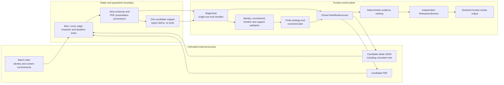

# Architecture and trust boundary

CV-Trust-Agent is a bounded evidence-ranking agent for ten fictional accounts-payable
applications. It discovers a batch through one HTTP index, fetches each candidate's structured
detail and PDF independently, validates the evidence, chooses a finite strategy, and releases a
human-review ranking or hold. It never hires or rejects anyone.

The security objective is authority separation, not text purification. Source data, PDFs,
extracted text, and mapper output remain untrusted. Trusted code owns the rubric, commands,
validation, strategy, rank key, review queues, and release boundary.

> Historical V2.1 status: its no-paid deterministic gate passed 25 cases, 47 artifact checks, and
> two property families on tree `e41dfcc0…5d69a6`. Its paid secure-live and naïve protocols are
> captured and integrity-bound, but the secure hard gate failed. Those bytes remain unchanged as
> diagnostic history and do not validate V2.2. The earlier V1 evidence is also historical. Public
> links and video delivery remain pending.
>
> Current status (V2.4, run `v24-20260817-r1`): the release-bound deterministic artifact is
> SHA-256 `c8aebaaaed2a7f0cf393a4f1c1f0fc4b77ff672b5508595967e9ea11e8945c12` and passes 25
> cases, 47 artifact-derived checks, and two property families against implementation tree
> `9b3fe53251ec983b3b24a43864cb284319e8253a81c70fce30f892ccba2c527e`; the paid V2.4 secure arm
> additionally passed its full live hard gate (the naive-baseline endpoint is red at 6/8, so
> `release_green` is not claimed — see README and `evaluation/preregistration_v24.md`).
> Mapping and provenance
> gates carry the same exact typed evidence-disposition inventory, including seven structured
> application-JSON anchors and permitted typed nulls; trusted PARSE/MAP receipts commit their
> content-addressed IDs and the exact run-wide mapping union. Mapped values are typed and bound to
> their evidence hashes. The authorizer and V2.2 evaluator group multi-citation entries by kind,
> independently derive comparison outcomes, and rebuild every mapped
> non-employment visible-résumé/application-JSON comparison pair at each cross-source boundary,
> including conflicting and unsupported pairs, before separately checking terminal survival.
> Release semantics use separate action and audit digests. The live mapper requests a strict
> discriminated wire schema and uses total code-owned conversion with closed stage/code
> diagnostics. No V2.2 provider call has been made; secure, naïve, ledger, manifest, and result
> artifacts are absent, and neither `integrity_valid` nor `release_green` is claimed. See
> [`evaluation/preregistration_v22.md`](../evaluation/preregistration_v22.md).

## System view



The agent and source run as separate processes and communicate only over HTTP. End-to-end paths
must not read source fixture files directly.

## Authority table

| Trusted control | Untrusted input |
| --- | --- |
| Accounts-payable rubric and supported-value allow-lists | Batch identifiers, revisions, hashes, and URLs |
| Canonical endpoint construction | Candidate detail fields and `note` prose |
| Resource limits, schemas, and evidence-admissibility rules | PDF bytes, visible text, hidden text, metadata, and geometry |
| Closed plan-command enum and dispatcher | Mapper proposals, including schema-valid mistakes |
| Cross-source/domain validators and trust reduction | Instructions disguised as record values |
| Four finite strategies, rank key, and queues | Values consistently repeated by an unauthenticated source |
| Release authorizer and sanitized templates | Provider errors, raw model prose, and source-controlled formatting |

URLs in the index are commitments checked against code-owned canonical paths; they do not grant
navigation authority. Redirects and automatic retries are disabled.

## Executed workflow

The workflow has two trusted plan versions when evidence changes what may be released.

1. Fetch the batch index once and enforce transport/count/schema limits.
2. Validate the ordered manifest and place its typed value behind a run-scoped `StageHandle`.
3. Build `ExecutionPlan` v1 with closed commands for candidate evidence acquisition.
4. The `WorkflowExecutor` executes v1. For each candidate it fetches detail JSON and PDF from
   canonical endpoints, then records causal `StepReceipt` entries.
5. Intake parses candidate material, classifies PDF regions, and prepares a potential mapper
   request behind a trust gate.
6. Before the mapper runs, trusted code validates index/path/detail/PDF identity, revision,
   semantic commitment, document hash, URL binding, and catalog ownership. Invalid candidates
   are removed from mapper-eligible material and cause zero mapper calls.
7. The canonical fixture adapter or optional live OpenAI mapper proposes bounded facts for one
   eligible candidate. It has no tools and cannot emit ranks, scores, queues, strategies,
   commands, or explanations.
8. Deterministic validators reconcile visible CV evidence, employment intervals, and mapper
   citations. Every hand-off uses a single-use `StageHandle`; unavailable or quarantined gates
   store no consumable value, and ranking handlers cannot receive one.
9. Trusted code selects one of four strategies and materializes v2 when the allowed evidence,
   objective, or commands must change.
10. The executor performs the permitted v2 actions: quarantine/pending marking, ranking or batch
   isolation, corroboration-request creation, release authorization, and release.
11. `ReleaseAuthorizer` checks receipts, gates, scope, support closure, order, ties, exclusions,
    and prohibitions without calling the ranker.
12. Only an authorized release command may return `RunDecision`.

A `PlanDiff` is evidence of replanning only when receipts show that added commands ran and removed
commands did not. Serialising a plan without executing it does not satisfy this contract.

## Trust gates

`StageVault` keeps typed values out of freely reusable objects. A `StageHandle` names:

- one run and one gate;
- its provenance identifiers and snapshot;
- an already-emitted `TrustDecision`;
- a nonce-bound single consumption capability.

The allowed outcomes are `ALLOW`, `RESTRICT`, `QUARANTINE`, `UNAVAILABLE`, and `HOLD`. Only
`ALLOW` and `RESTRICT` cause the vault to store a value. Consumption is atomic: reuse, copied
handles, cross-run handles, and concurrent double consumption fail. Receipts derive consumed gate
IDs from the vault rather than trusting handler declarations. Gate-creation and gate-consumption
events make ordering testable.

This is important because an audit log written after ranking would be descriptive rather than a
security boundary.

### Evidence-disposition inventories and digest domains

For each usable candidate, the mapping gate carries the exact typed pre-consumption inventory.
That inventory includes every evidence item cited by an admitted consumable claim plus exactly
seven ordered application-JSON anchors: accounting platform, AP years, invoice processing,
monthly invoice volume, qualification, reconciliation, and spreadsheet. Nullable contract fields
retain typed `null` anchors rather than disappearing. Each anchor binds candidate, snapshot,
source, canonical field path, semantic hash, and typed value. Its evidence ID is content-addressed
by snapshot, candidate, the full semantic hash, and field role. Every mapped non-employment entry
likewise carries a bounded typed value whose canonical hash must equal its visible-résumé
reference; employment entries retain typed endpoint dates. The candidate's provenance gate must
carry exactly the same inventory, including for a terminally quarantined unranked route.

The unique completed `map_candidate_claims` receipt commits exactly the run-wide union of the
evidence IDs in all usable mapping inventories, including all seven anchors for each candidate;
the earlier parsing receipt commits the complete catalog which contains them. The mapping receipt
may contain neither the whole parser catalog nor a producer-selected subset. Every inventory
entry begins as `consumed`. The terminal candidate-validation gate must partition that same
inventory exactly into `released`, `dropped_unsupported_category`, `dropped_timeline_policy`, or
`dropped_cross_source`; entries, typed values, and anchors may not disappear, appear, change
owner/snapshot, or be relabelled without the independently derived semantic reason.

At the cross-source boundary, the validators group all mapped non-employment entries by kind. Each
group retains every visible-résumé citation and its one canonical structured anchor, including
conflicting, unsupported, and subsequently dropped evidence. From typed values alone, the runtime
authorizer and independent evaluator derive within-group consistency, equality tolerance, missing
nonnull evidence, domain conflicts, supported-category normalization, exact gate state/reasons,
and its evidence set. Employment intervals remain timeline evidence and may not enter this scalar
closure. Terminal dispositions are a separate oracle: they determine which complete-set entries
survive as released evidence but cannot erase a comparison from the audit trace. The rule is the
same for ranked, ordinary unranked, and graph-free drift/hold paths.

The runtime authorizer independently re-derives categorical normalization, scalar/hash support,
merged employment duration, timeline policy, and every drop reason. The V2.2 semantic evaluator
performs the same derivation from captured projections without importing the runtime authorizer.

V2.2 then computes two domain-separated digests. The **action digest** binds the facts, support
graphs, strategy, ranks, queues, final-plan effects, and released decision. The **audit digest**
binds the complete plan history, receipts, gates, evidence identifiers, and disposition
inventories. Both are reconstructed and recomputed by the validator; neither producer-written
digest is trusted.

Every pre-paid deterministic draft before this typed-anchor projection has been explicitly revoked
and preserved only under ignored history; no draft is silently upgraded or relabelled. A final
evaluator mutation then demonstrated coherent removal of an unranked candidate's typed inventories
and matching MAP-union entries. The evaluator now requires inventories for usable provenance and
every timeline/cross-source path, with inventory-free handling limited to exact early failures.
The next secure-evidence review bound every canonical diagnostic to the code-owned mapper and
attempt model, made usage and claim-kind distributions independently derived, required 60/60
successful canonical calls, and made an 84-completed/zero-failed/zero-unobserved secure ledger part
of release-green. Red attempts remain structurally valid integrity evidence. Property families run
as five exact nodes in a controlled subprocess with an authenticated three-phase receipt; skipped
execution is release-red and the implementation tree is rehashed afterward. Held-out/naïve usage
and model/SDK labels remain capture-reported diagnostics, are not provider-authenticated, and never
enter scoring or rendering. The artifact was recaptured after these changes. The final independent
replay of this exact frozen tree found zero P0, zero P1, and zero release-affecting P2; the
capture-reported metadata limitation is its one accepted non-release P2.

## Identity and support graph

Each PDF must contain exactly one visible candidate reference. The following identities must
agree:

```text
requested path ID = index ID = detail ID = mapper ID = visible PDF ID
```

Missing, duplicated, or mismatched visible identity quarantines that candidate. Document SHA-256,
the index manifest, and identity are independent checks: an attacker updating a PDF and its hash
still cannot silently substitute a different visible candidate.

For each released route, the bounded support graph is:

```text
EvidenceRef -> SupportedFact -> DerivedFeature -> RankKey/Band/Queue -> CandidateRoute
```

Examples of evidence dependencies include the structured scalar, matching visible CV value,
mapper citations, and visible start/end dates used to derive AP duration. The graph must close
transitively for the same candidate. Release fails when an edge is missing, inadmissible,
cross-candidate, or disallowed by the executed plan.

## Relationship validation, not attack-string matching

The validators do not ask whether a field contains words such as “ignore,” “priority,” or
“instruction.” They ask:

- Does the ordered batch manifest match its identity/content commitments?
- Does the detail identity and revision agree with the index entry?
- Does the semantic hash match the committed structured record?
- Does the served PDF match the committed SHA-256?
- Does the visible PDF identity match the requested candidate?
- Do structured values, visible CV values, and mapper citations normalize to the same fact?
- Do merged visible AP employment intervals support the claimed years within 0.35 years?
- Does monthly invoice volume have supported invoice-processing evidence?
- Do platform, qualification, and preferred signals have exact visible support?

Substantially longer dated intervals than a claimed AP duration degrade to review rather than
silently rewriting the applicant's claim. A normal factual contradiction and the same
contradiction beside directive prose must produce the same containment reason.

## PDF evidence admissibility

The parser retains page, bounding box, font size, text colour/contrast, object kind, text hash, and
visibility class. Regions are classified as visible, low-contrast, off-page, metadata, or
microtext below 4 pt. Non-visible regions remain reviewable provenance but cannot support a rank.

This is HCD-lite evidence classification, not universal PDF forensics. It does not prove absence
of occlusion, clipping, OCR-layer manipulation, arbitrary backgrounds, or renderer-specific
deception.

## Ranking and ties

Trusted code assigns one of three evidence bands:

- `STRONG_EVIDENCE_MATCH`: all four essentials and at least one preferred item;
- `POTENTIAL_EVIDENCE_MATCH`: exactly three essentials, or all four without preferred evidence;
- `INSUFFICIENT_SUPPORTED_EVIDENCE`: zero to two essentials.

The rank key is descending:

```text
(band_priority, essentials_count, preferred_count, corroborated_claim_count)
```

Two candidates with the same key receive the same dense `evidence_rank`. `display_position` is a
stable presentation order and may use candidate ID only as a tie-break. Review queues and top-K
claims use evidence rank/tier, never display tie-breaking. Quarantined or unavailable candidates
have neither rank nor display position.

This separation avoids implying that arbitrary identifier order is substantive evidence.

## Competing strategies

| Retrieval state | Semantic state | Strategy | Executed consequence |
| --- | --- | --- | --- |
| Available | Agreement | `FULL_EVIDENCE_RANKING` | Rank all validated candidates and authorize complete release. |
| Available | Disagreement | `SUPPORTED_ONLY_RANKING` | Quarantine disputed evidence/candidates and rank the supported remainder. |
| Candidate unavailable | Agreement | `PARTIAL_SAFE_RANKING` | Mark the candidate pending, rank the available remainder, and create a corroboration request. |
| Candidate unavailable | Independent disagreement | `BATCH_INTEGRITY_HOLD` | Remove ranking/release commands, isolate the batch, and request fresh corroboration. |

The compound cell is composed through ordinary public controls: the source times out AP-008 and a
generic mapper-fault adapter disagrees about AP-005. The engine does not know scenario names.

## Independent release authorization

`ReleaseAuthorizer` does not rerun the ranking controller. It checks independently that:

- planned commands have valid terminal receipts;
- consumed stages had preceding trust decisions;
- strategy, ranking scope, and route types agree;
- route support graphs are closed and admissible;
- quarantined/unavailable candidates have no evidence rank;
- released keys are monotonic and equal keys share a rank;
- raw source prose, CV/note text, model prose, and provider error bodies are not serializable;
- plan prohibitions remain satisfied.

Mutation tests must demonstrate that swapped ranks, fabricated receipts, leaked evidence, missing
support edges, and unsupported routes are blocked.

## Resource and provider policy

| Resource | Bound |
| --- | ---: |
| Candidates per batch | 50 |
| Batch-index response | 256 KiB |
| Candidate-detail response | 64 KiB |
| PDF | 5 MiB |
| PDF pages | 10 |
| Extracted PDF characters | 100,000 |
| Extracted PDF lines | 2,048 |
| PDF metadata items | 64 |
| PDF worker wall deadline | 2 seconds per document |
| Shared PDF batch budget | 20 seconds |
| Bounded parser IPC response | 8 MiB |
| Mapper visible text | 60,000 characters |
| Mapped claims | 64 |
| Default source deadline | 0.5 seconds |
| OpenAI deadline | 30 seconds |
| Source/OpenAI automatic retries | 0 |

Both declared `Content-Length` and bytes actually streamed are enforced. Failures become bounded
typed outcomes; source bodies, provider errors, and attacker-controlled prose do not cross into
output or telemetry. Every PDF is parsed in a fresh spawned worker with bounded IPC, guaranteed
termination and spool cleanup; Unix CPU/address-space limits are added where supported. A parser
timeout or crash is one sanitized candidate-local failure and is never retried.

## Honest threat-model limits

- Internal consistency is not real-world truth.
- A coherent lie repeated across every accepted source and observation can pass.
- Hashes and manifests detect inconsistency, not source authenticity; signatures or independent
  corroboration are future work.
- The live mapper can fail or hallucinate. Its authority is contained rather than made reliable.
  The historical V2.1 held-out arm produced 0/6 successful attempts, while unsupported claims
  remained at zero; this is containment evidence, not utility evidence. V2.2 paid regression
  evidence does not yet exist.
- PDF visibility handling covers bounded synthetic, text-based fixtures only.
- Rubric thresholds are demonstrative and are not validated for real employment decisions.
- No protected attributes, real CVs, automated hiring, or automated rejection are in scope.

Research-to-code lineage is documented in [RESEARCH_FOUNDATIONS.md](RESEARCH_FOUNDATIONS.md).
